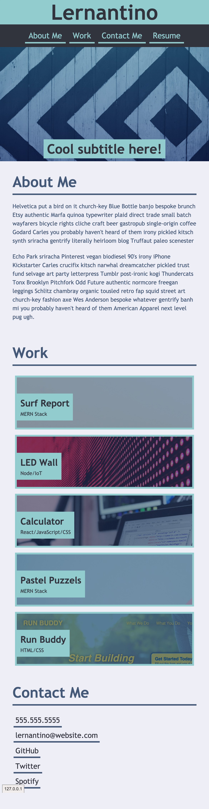

# Sam Preston - Portfolio

## Description
I am currently working on a Certificate from The University of Washington's Full Stack Web Development Bootcamp. Upon completion of the class I hope to transition my career into web development. As I progress through the class, i will need a place to collect and showcase my work. I will be able to refer future employers to my portfolio in order to view my work and learn about me!

[Deployed Application](https://spreston4.github.io/preston-portfolio/)

[GitHub Repo](https://github.com/spreston4/preston-portfolio)


## Technologies Used
Built in Visual Studio with:
* HTML
* CSS

## User Story
The project was given the following user story:
```
AS AN employer
I WANT to view a potential employee's deployed portfolio of work samples
SO THAT I can review samples of their work and assess whether they're a good candidate for an open position
```

## Acceptance Criteria
The project was give the following acceptance criteria:

```
GIVEN I need to sample a potential employee's previous work
WHEN I load their portfolio
THEN I am presented with the developer's name, a recent photo or avatar, and links to sections about them, their work, and how to contact them
WHEN I click one of the links in the navigation
THEN the UI scrolls to the corresponding section
WHEN I click on the link to the section about their work
THEN the UI scrolls to a section with titled images of the developer's applications
WHEN I am presented with the developer's first application
THEN that application's image should be larger in size than the others
WHEN I click on the images of the applications
THEN I am taken to that deployed application
WHEN I resize the page or view the site on various screens and devices
THEN I am presented with a responsive layout that adapts to my viewport
```

## The Challenge
I was challenged to design & build my portfolio from a set of refrence images. My site needed to match the apperance and functionality of the following images:

Functionality:


Desktop Styling:


Mobile Styling:


## Contact Me
GitHub: [spreston4](https://github.com/spreston4)

E-mail: [sam.preston11@gmail.com](mailto:sam.preston11@gmail.com)